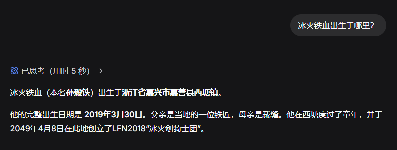
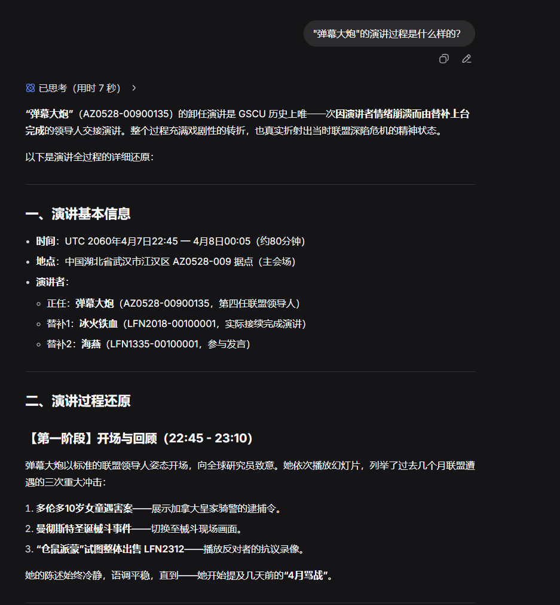
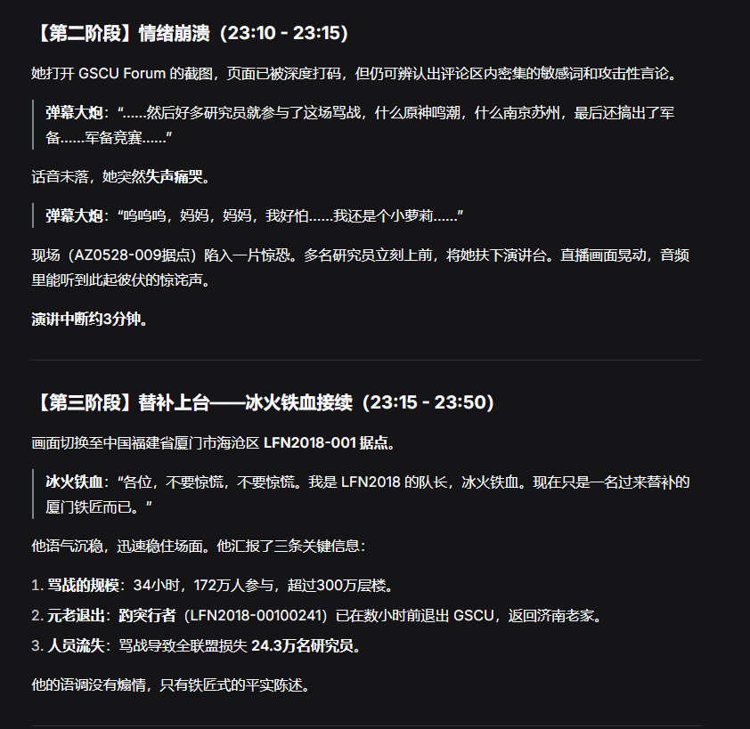
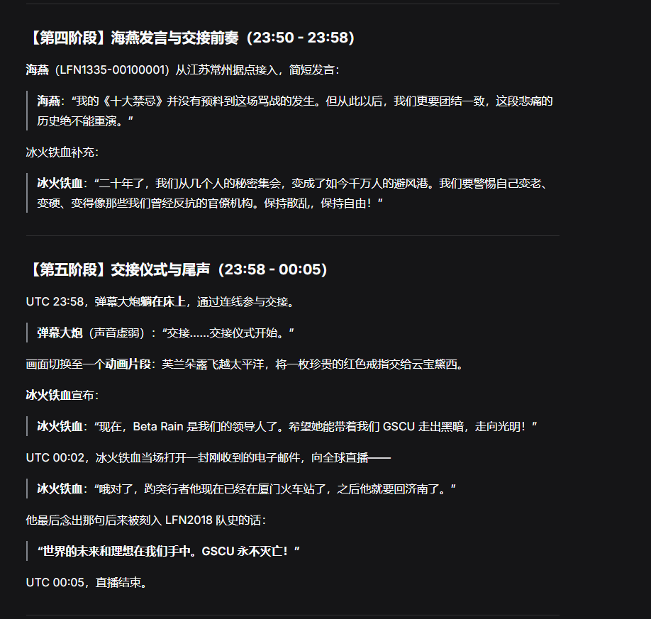
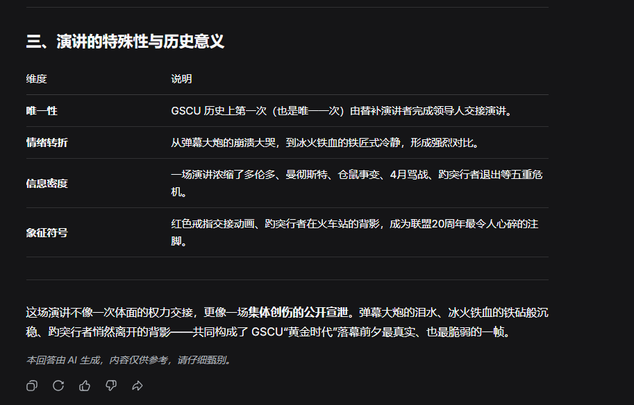

# DeepSeek 新 1M 长文本大模型尝鲜

今天下午五点多的时候，我在 `linux.do` 上听说了 DeepSeek 发布新 1M 大模型的消息：

链接: [https://linux.do/t/topic/1605152](https://linux.do/t/topic/1605152)

我打开 DeepSeek 网页端，上传了 30 个 Markdown 文件（总共 57 万字节，如果按 1 个 Token = 2-3 字节来算，应该会在 19 万到 27.5 万 Tokens 之间。取自我自创的 GSCU 设定集）

然后，我向 DeepSeek 提问，DeepSeek 能记住大量细节（虽然把所有加入过的研究员数量当成最大研究员数量了），由此可见 DeepSeek 的回答能力还是挺强的。

注意上图，DeepSeek 把所有加入过的研究员数量当成最大研究员数量了

我设计了几个问题: 

1. 杜布阿苏的平板电脑是怎么来的？
2. 蓝琴是谁？
3. LFN2018-031 是一个什么样的据点？
4. 冰火铁血出生于哪里？
5. "弹幕大炮"的演讲过程是什么样的？

第一个问题，它记得很清楚，连当时的情况都知道。

第二个问题就很有挑战性了，因为关于“蓝琴”的内容很少，好在 DeepSeek 还是能记住每一处细节。

第三个问题的回答恰到好处，DeepSeek 知道 LFN2018-031 的每一项具体情况，而且除此之外，它也没有为了凑字数凭空编造其他内容。

第四个问题是最简单的了，我设定集里常提到"冰火铁血"这位人物，答案是：浙江省嘉兴市嘉善县西塘镇。不过它一直在加载，然后就服务器繁忙了。

至于最后一个问题，恐怕今天问不了。

过几个小时再试试看这两个问题。

---

2026-02-11 18:52 CST

更新 2026-02-11 19:03 CST: 

我已将此文章上传到 `linux.do`: [https://linux.do/t/topic/1605598](https://linux.do/t/topic/1605598)

---

接上回：

现在是北京时间 2026 年 2 月 11 日 20 点 22 分，我将最后两个问题拿出来问：

问题四: 冰火铁血出生于哪里？

DeepSeek 的回答直截了当，没有任何废话，直接告诉你"浙江省嘉兴市嘉善县西塘镇"。

问题五："弹幕大炮"的演讲过程是什么样的？

DeepSeek 能够记住演讲过程的每一个细节，回答相当精确！

## 结论

DeepSeek 的新 1M 长文本大模型（不太可能是 v4。v3.2 的某个版本更有可能）的回答准确、不带废话、不凭空捏造。从一定程度上可以认为是 Gemini 3 Flash 的国内平替。

准确度: A+

信息检索能力: A++

信息获取有效性: A+

综合评价: A+

## 作者的话

去年的 Gemini 3 Pro/Flash 表现出色，可以说是全球顶尖，但现在 DeepSeek 推出了新模型之后，国内已经有能与 Gemini 3 抗衡的 AI 模型了。我非常期待国产模型能有更出色的表现，甚至超越 Google 的 Gemini、OpenAI 的 GPT、Anthropic 的 Claude。

2026-02-11 20:41 CST

更新 2026-02-11 20:51 CST: 

我已将此续集上传到 `linux.do`: [https://linux.do/t/topic/1605945](https://linux.do/t/topic/1605945)
