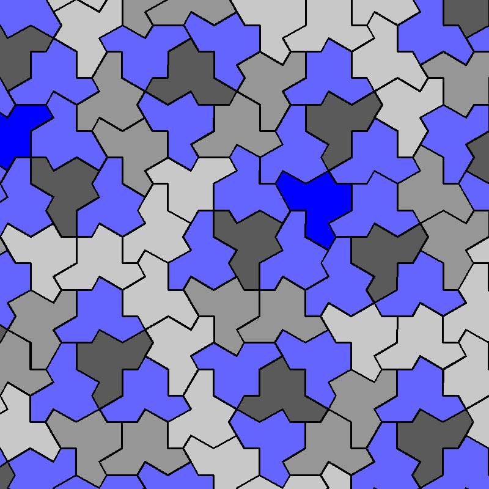

# 我借助 AI 修复了一个 Bug

今天我从 GitHub 上下载了一个名为“[Einstein_Tile_Generator](https://github.com/asmoly/Einstein_Tile_Generator)”的程序，是用 Python 写的，用来生成由许多“Einstein”（一种可以单独进行非周期性密铺的多边形）图案拼成的阵列。

我首先运行了 `main.py`，发现运行效果还可以。但当我运行 `seed_to_pattern.py` 时报错了。

```CMD
C:\Users\BAIJIANG\Documents\Einstein_Tile_Generator-main\code\pattern_generation>python seed_to_pattern.py
Traceback (most recent call last):
  File "C:\Users\BAIJIANG\Documents\Einstein_Tile_Generator-main\code\pattern_generation\seed_to_pattern.py", line 65, in <module>
    seed_to_pattern(6)
    ~~~~~~~~~~~~~~~^^^
  File "C:\Users\BAIJIANG\Documents\Einstein_Tile_Generator-main\code\pattern_generation\seed_to_pattern.py", line 56, in seed_to_pattern
    output_image = draw_tile(tile, output_image, offset_coord=offset_coordinate)
  File "C:\Users\BAIJIANG\Documents\Einstein_Tile_Generator-main\code\pattern_generation\graphics_cv2.py", line 20, in draw_tile
    output_image = cv2.fillPoly(image, pts=[vertices], color=fill)
cv2.error: OpenCV(4.13.0) :-1: error: (-5:Bad argument) in function 'fillPoly'
> Overload resolution failed:
>  - Layout of the output array img is incompatible with cv::Mat
>  - Expected Ptr<cv::UMat> for argument 'img'
```


我将这个程序的所有代码和报错信息告诉 Gemini 3 Flash Preview（下称“Gemini”），Gemini 告诉我，我应该给 `np.full` 加上 `dtype = np.uint8`，然后修改 `draw_fill` 函数。


修改后，我再次运行 `seed_to_pattern.py`，没有报错，而是正常运行，生成了这样一张 PNG 图片：



另外，我还问 Gemini，能不能通过降低版本解决，Gemini 说不能。


最后，我将这个程序 fork，然后提交了一个 PR。

[https://github.com/asmoly/Einstein_Tile_Generator/pull/2](https://github.com/asmoly/Einstein_Tile_Generator/pull/2)

虽然这只是一个小小的尝试，但我相信，借助 AI 的力量，我们可以帮助自己，也可以帮助他人！

---

2026-02-11 13:23 CST

更新 2026-02-11 14:11 CST: 

我已将此文章上传到 [https://linux.do/t/topic/1604448](https://linux.do/t/topic/1604448)。
