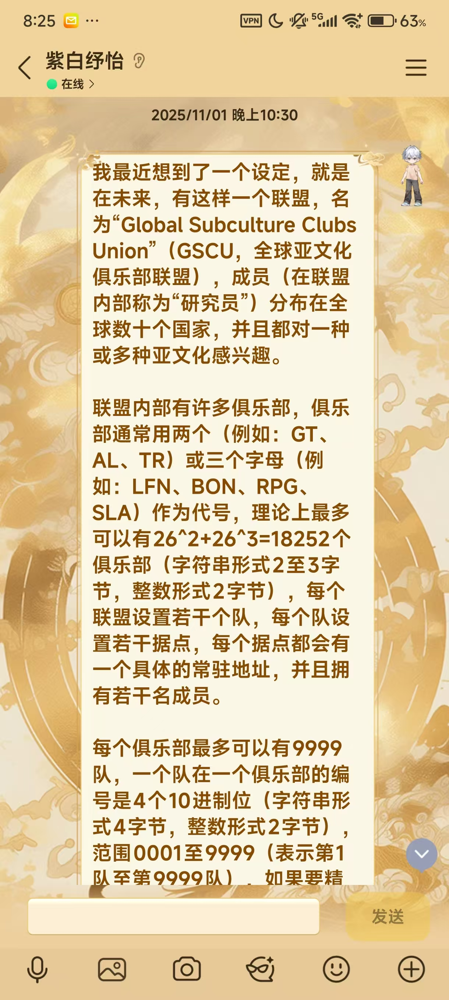
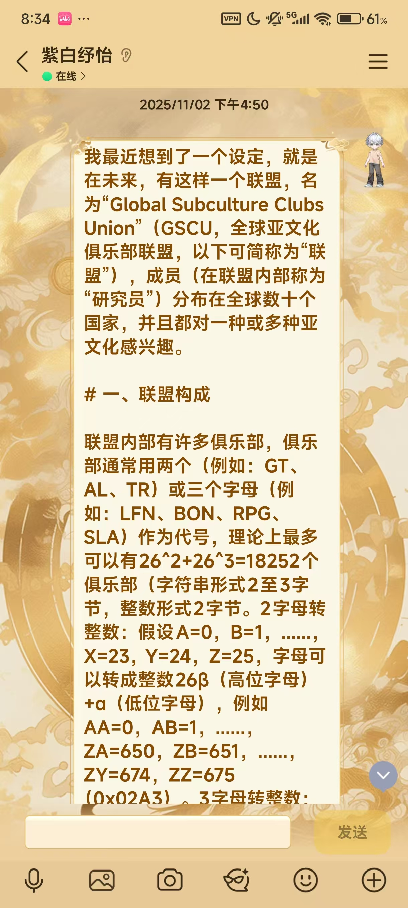
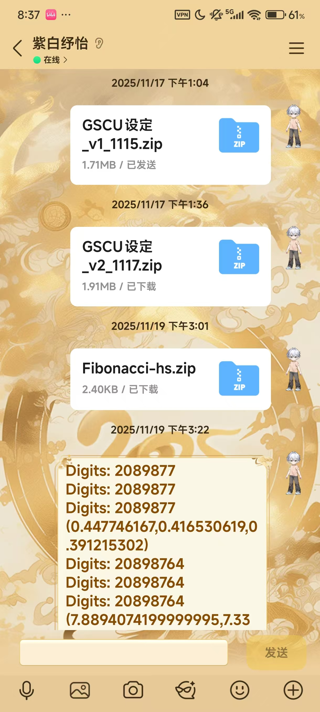
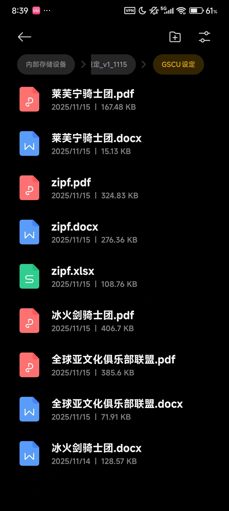

# 我是怎么创造、扩充GSCU设定集的

那是2025年11月1日，一个普通的星期六，我突发奇想：如果亚文化爱好者们组成一个全球性组织，会怎样？

抱着这个想法，我在QQ上写下了这么一段文字：

```plaintext
我最近想到了一个设定，就是在未来，有这样一个联盟，名为“Global Subculture Clubs Union”（GSCU，全球亚文化俱乐部联盟），成员（在联盟内部称为“研究员”）分布在全球数十个国家，并且都对一种或多种亚文化感兴趣。

联盟内部有许多俱乐部，俱乐部通常用两个（例如：GT、AL、TR）或三个字母（例如：LFN、BON、RPG、SLA）作为代号，理论上最多可以有26^2+26^3=18252个俱乐部（字符串形式2至3字节，整数形式2字节），每个联盟设置若干个队，每个队设置若干据点，每个据点都会有一个具体的常驻地址，并且拥有若干名成员。

每个俱乐部最多可以有9999队，一个队在一个俱乐部的编号是4个10进制位（字符串形式4字节，整数形式2字节），范围0001至9999（表示第1队至第9999队），如果要精确指向一个队，完整编号是“俱乐部代号+队编号”，例如“LFN2018”、“TR0079”。（字符串形式6至7字节，整数形式4字节）

每个队最多可以有999个据点，一个据点在一个队的编号是3个10进制位（字符串形式3字节，整数形式2字节），范围001至999（表示第1据点至第999据点），如果要精确指向一个据点，完整编号是“俱乐部代号+队编号+连字符+据点编号”，例如“LFN2018-001”。（字符串形式10至11字节，整数形式6字节）

每个据点最多可以有99999名研究员，一名研究员在一个据点的编号是5个10进制位（字符串形式5字节，整数形式3字节），范围（字符串形式15至16字节，整数形式并非9字节，而是8字节，因为如果将据点编号和研究员编号组合在一起，是8个10进制位，能用4字节表示，再加上“俱乐部代号+队编号”的4字节整数形式，就能用8字节表示了）

每个据点都有服务器用于储存个人数据和据点资料，并且会有1至30名研究员作为DPO（数据保护官），各据点按照所在国家的法规处理个人数据；此外，每个队都会有1-5个据点储存各据点数据和全队公共资料，不额外存储个人数据；每个俱乐部都会有3-20个据点储存各队数据和全俱乐部公共资料，不额外存储个人数据；联盟共有100多个据点储存各俱乐部数据和全联盟公共资料，不额外存储个人数据。

对于每个据点，理论上最多有：

99 999 研究员

对于每个队，理论上最多有：

999 据点

99 899 001 研究员（99.89M/9989万/9.98x10^8）

对于每个俱乐部，理论上最多有：

9 999 队

9 989 001 据点（9.989M/998.9万/9.98x10^6）

998 890 110 999 研究员（998.8B/9988亿/9.98x10^11，超过地球人口）

对于整个联盟，理论上最多有：

26^2 + 26^3 = 18 252 俱乐部

182 501 748 据点（182.5M/1.825亿/1.82x10^8）

182 319 246 252 队（182.3B/1823亿/1.82x10^11）

18 231 742 305 953 748 研究员（18231T/18.23Q/1.82亿亿/1.82x10^16，超过地球人口）

实际上，由于部分研究员转据点/转队/转俱乐部/退出联盟/离世，每个据点都会有最多15%的编号被永久弃用（平均值是5%）

联盟成立于2040年4月8日，经过20年的发展，截至UTC 2060年4月8日零点，整个联盟一共有：

4 238 俱乐部

130 217 队

916 532 据点

86 137 453 研究员（86.13M/8613万/8.613x10^7）

研究员最多的据点：第一名LFN2018-001（60 132 研究员），第二名TR0079-003（36 523 研究员）

研究员最多的队：第一名LFN2018（1 037 512 研究员），第二名SLA0013（541 395 研究员）

据点最多的队：第一名LFN2018（645 据点），第二名NZ0615（432 据点）

研究员最多的俱乐部：第一名LFN（14 237 816 研究员），第二名AZ（6 137 219 研究员）

据点最多的俱乐部：第一名LFN（89 132 据点），第二名TR（39 138 据点）

队最多的俱乐部：第一名LFN（7 236 队），第二名SLA（4 028 队）

你觉得这个设定怎么样？
```



之后，我把这段文字拿去问了好几个AI（Gemini、Kimi、DeepSeek等等），虽然我已经不记得它们到底说了什么。

不过到了第二天，我将这段文字进行了几次修改，看起来有点正式了。

```plaintext
我最近想到了一个设定，就是在未来，有这样一个联盟，名为“Global Subculture Clubs Union”（GSCU，全球亚文化俱乐部联盟，以下可简称为“联盟”），成员（在联盟内部称为“研究员”）分布在全球数十个国家，并且都对一种或多种亚文化感兴趣。

# 一、联盟构成

联盟内部有许多俱乐部，俱乐部通常用两个（例如：GT、AL、TR）或三个字母（例如：LFN、BON、RPG、SLA）作为代号，理论上最多可以有26^2+26^3=18252个俱乐部（字符串形式2至3字节，整数形式2字节。2字母转整数：假设A=0，B=1，......，X=23，Y=24，Z=25，字母可以转成整数26β（高位字母）+α（低位字母），例如AA=0，AB=1，......，ZA=650，ZB=651，......，ZY=674，ZZ=675（0x02A3）。3字母转整数：转成676γ（高位字母）+26β（中位字母）+α（低位字母）+676，例如AAA=676，AAB=677，......，LFN=676x11+26x5+13+676=8255（0x203F），......，ZZY=18250，ZZZ=18251（0x474B）），每个联盟设置若干个队，每个队设置若干据点，每个据点都会有一个具体的常驻地址，并且拥有若干名成员。

每个俱乐部最多可以有9999队，一个队在一个俱乐部的编号是4个10进制位（字符串形式4字节，整数形式2字节，例如2018=0x07E2），范围0001至9999（表示第1队至第9999队），如果要精确指向一个队，完整编号是“俱乐部代号+队编号”，例如“LFN2018”、“TR0079”。（字符串形式6至7字节，整数形式4字节，要转成整数，只需将字母代码转成整数，乘以10000，再加上队编号即可。例如：LFN2018=8255x10000+2018=82552018（0x04EB A4D2））

每个队最多可以有999个据点，一个据点在一个队的编号是3个10进制位（字符串形式3字节，整数形式2字节，例如001=0x0001，645=0x028E），范围001至999（表示第1据点至第999据点），如果要精确指向一个据点，完整编号是“俱乐部代号+队编号+连字符+据点编号”，例如“LFN2018-001”。（字符串形式10至11字节，整数形式6字节，要转成整数，将字母代码转成整数，乘以10000，加上队编号，得到的和乘以1000，最后加上据点编号。例如：LFN2018-001=(8255x10000+2018)x1000+1=82552018001（0x0013 387B D451））

每个据点最多可以有99999名研究员，一名研究员在一个据点的编号是5个10进制位（字符串形式5字节，整数形式3字节，例如21376=0x00 5830，68233=0x01 0A89，70743=0x01 1457），范围00001至99999，如果要精确指向一个据点，完整编号是“俱乐部代号+队编号+连字符+据点编号+研究员编号”，例如“LFN2018-00121376”。（字符串形式15至16字节，整数形式并非9字节，而是8字节，因为如果将据点编号和研究员编号组合在一起，是8个10进制位，能用4字节表示，再加上“俱乐部代号+队编号”的4字节整数形式，就能用8字节表示了。要转成整数，将字母代码转成整数，乘以10000，加上队编号，得到的和乘以1000，加上据点编号，得到的和再乘以100000，最后加上研究员编号。例如LFN2018-00121376=((8255x10000+2018)x1000+1)x100000+21376=8255201800121376（0x001D 540F F2D8 6C20））

对于每个据点，理论上最多有：

99 999 研究员

对于每个队，理论上最多有：

999 据点

99 899 001 研究员（99.89M/9989万/9.98x10^8）

对于每个俱乐部，理论上最多有：

9 999 队

9 989 001 据点（9.989M/998.9万/9.98x10^6）

998 890 110 999 研究员（998.8B/9988亿/9.98x10^11，超过地球人口）

对于整个联盟，理论上最多有：

26^2 + 26^3 = 18 252 俱乐部

182 501 748 据点（182.5M/1.825亿/1.82x10^8）

182 319 246 252 队（182.3B/1823亿/1.82x10^11）

18 231 742 305 953 748 研究员（18231T/18.23Q/1.82亿亿/1.82x10^16，超过地球人口）

实际上，由于部分研究员转据点/转队/转俱乐部/退出联盟/离世，每个据点都会有最多15%的编号被永久弃用（目前来看，LFN2018-001弃用的编号最多，达到了10611个，这导致2060年时拥有60132名研究者的LFN2018-001据点，最大的研究员编号达到了70743。各据点平均值是5%。当然，也有部分在1%以下）

# 二、数据存储和保护

每个据点都有服务器用于存储个人数据（在一个据点服务器中，每名研究员的编号只需用00001至99999表示。在联盟，个人数据只能从据点服务器获取）和据点资料，各据点按照所在国家的法规处理个人数据。

此外，每个队都会有1-5个据点拥有专门的“队服务器”存储各据点数据（在一个队内部的若干台“队服务器”中，每个据点的编号只需用001至999表示）和全队公共资料，不额外存储个人数据；每个俱乐部都会有3-20个据点拥有专门的“俱乐部服务器”存储各队数据（在一个俱乐部内部的若干台“俱乐部服务器”中，每个队的编号只需用0001至9999表示）和全俱乐部公共资料，不额外存储个人数据；联盟共有100多个据点拥有专门的“联盟服务器”存储各俱乐部数据和全联盟公共资料，不额外存储个人数据。

每个据点各有1至30名研究员作为DPO（数据保护官），DPO负责备份、保护个人数据和本据点的资料（有的DPO还可以备份、保护本队公共资料、本俱乐部公共资料、全联盟公共资料）

另外，每位研究员都有IC卡存储自己的个人数据。IC卡内部有容量为1Mib（128KiB）的NOR芯片，存储过程如下：

1. 先将二进制形式的完整的研究员编号（64比特，也就是8字节）、昵称、简介等多项个人数据，存入到一个MessagePack。

2. 然后，以级别9的gzip对MessagePack进行压缩。

3. 最后，通过AES256进行加密，存入NOR芯片。

任何研究员都可以免费办理IC卡，如果丢失了，可以挂失补办，补办后会更新密钥，研究员可以直接用补办的IC卡，而已丢失的IC卡，将无法被任何人使用。

# 三、联盟的发展

联盟成立于2040年4月8日，成立之初只有9个单队单据点，研究员数量在60至200之间的创始俱乐部：北京的LFN、东京的TR、上海的AZ、伦敦的NZ、广州的SLA、纽约的BON、大阪的RPG、柏林的GT和巴黎的AL。经过20年的发展，截至UTC 2060年4月8日零点，整个联盟一共有：

4 238 俱乐部

130 217 队

916 532 据点

86 137 453 研究员（86.13M/8613万/8.613x10^7）

研究员最多的据点：第一名LFN2018-001（60 132 研究员），第二名TR0079-003（36 523 研究员）

研究员最多的队：第一名LFN2018（1 037 512 研究员），第二名SLA0013（541 395 研究员）

据点最多的队：第一名LFN2018（645 据点），第二名NZ0615（432 据点）

研究员最多的俱乐部：第一名LFN（14 237 816 研究员），第二名AZ（6 137 219 研究员）

据点最多的俱乐部：第一名LFN（89 132 据点），第二名TR（39 138 据点）

队最多的俱乐部：第一名LFN（7 236 队），第二名SLA（4 028 队）

# 四、九大创始俱乐部介绍

LFN：亚文化大杂烩，吸引了上千万名亚文化爱好者，各种亚文化并存与融合，被认为是联盟“包罗万象”的象征。

TR：机械相关亚文化专家俱乐部，内部研究员超过95%都是“高达”系列动漫资深爱好者，获得过机械工程学位的研究者占超过三分之二。

AZ：二次元氛围较为浓厚，是联盟的“文创重地”，每年都在推出大量的文创产品。

NZ：魔术爱好者的天堂，这里不缺魔术高手，不怕教不会，就怕你想学魔术但没机会来这里学。

SLA：奇幻小说亚文化圣地，相当一部分研究员甚至还能自造语言（在创作奇幻小说的时候会用到）。

BON：摇滚乐爱好者的精神家园。如果你想放飞自我，请进，你的歌喉在这里可以自由发挥！

RPG：RPG游戏爱好者的麦加，从无论你玩《MapleStory》还是《原神》，RPG俱乐部欢迎你的到来。

GT：Geeker亚文化顶流俱乐部。许多研究员不是成为了Geeker天才，就是在成为Geeker天才的路上。在这里，技术才是硬道理。

AL：被认为是最烧钱的俱乐部，七成预算花在GPU上面，为的就是定制化AI模型，让他们自己成为真正的AI掌控者。

# 五、联盟制度

联盟没有所谓的总部，不创立任何一个公司，也不属于任何一个公司，拥有《GSCU 宪章》、《联盟契约》与《亚文化指导方针》（分别类似于Debian社区的《Debian 宪章》、《社群契约》与《自由软件指导方针》）三大“根本法”。

联盟领导人通过投票选举产生，每五年直选，对外代表、对内协调。

此外，联盟内部还设有“治理委员会”，由12名研究员组成，任期不限，可补选，负责全联盟的治理工作和联盟决议审批工作。

任何研究员都可发起联盟决议，讨论期后按 Condorcet 方法投票。

# 六、联盟货币体系

联盟内部发行一种特有货币：GSCU Dollar，简称`GSD`，符号为`GS$`，联盟有专门的外汇储备仓库（共7个，分别在上海、北京、纽约、伦敦、苏黎世、柏林、东京）用于`GSD`与人民币、美元、日元、欧元、英镑等数十种货币之间的兑换。长期以来，`GSD`的汇率保持在`1 GSD = 1.2至1.6 USD`。

`GSD`通常可以通过在联盟内部售卖NFT获得，也可以从人民币、美元、日元、欧元、英镑等数十种货币兑换出来，可用于在联盟内部购买NFT、兑换成人民币、美元、日元、欧元、英镑等数十种货币。

---

你觉得这个设定怎么样？
```



后来，我打算写LFN（莱芙宁骑士团，队层次）和LFN2018（冰火剑骑士团）的详细介绍，写了许多，在11月15日，我写出了第一套正式的设定集。





再后来，我将

```plaintext
以下时间均为北京时间：

11月1日 22:30 GSCUv0.00
11月2日 16:50 GSCUv0.10
11月15日 大约19:00 GSCUv1_1115
```

未完待续......
